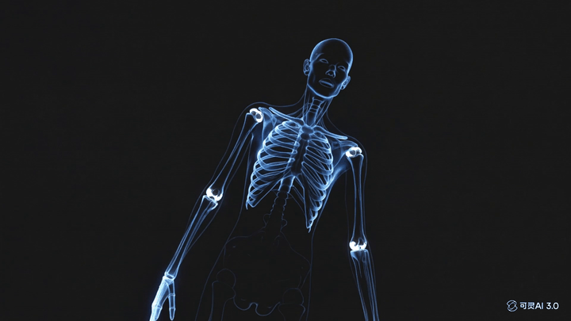

<p align="center">
  <h1 align="center">FitAI-Web</h1>
  <p align="center">
    <strong>开源 AI 健身教练，带因果健康智能</strong>
    <br />
    隐私优先 · 可自托管 · 学术级算法
  </p>
</p>

<p align="center">
  
  
  
  
</p>

<p align="center">
  <a href="https://fitmate.top">
    
  </a>
</p>

<p align="center">
  <a href="README.md">English</a> · <a href="README.zh-CN.md">中文</a>
</p>

---

<p align="center">
  
</p>

**FitAI 盯着你的动作，告诉你恢复分数为什么下降，并帮你规划明天——自托管、隐私优先。**

- **实时动作纠正** — 对着摄像头，FitAI 实时纠正你的深蹲、俯卧撑、平板支撑、弓步和 YTW（MediaPipe）。
- **因果，而非只是描述** — PC-stable 因果发现 + 贝叶斯恢复评分，解释*为什么*你的身体会这样反应。
- **自托管 & 隐私** — 你的健康数据留在你自己的机器上。$5/月的 VPS 就能跑，零 numpy/scipy（纯 Python 标准库）。

## FitAI-Web 是什么？

FitAI-Web 是一个全栈、开源的 AI 健身教练平台，把**因果推断**、**贝叶斯恢复建模**和**概率异常检测**与一个对话式 AI 智能体结合起来。不同于只告诉你「发生了什么」的健身追踪器，FitAI 告诉你**为什么发生**、以及**该怎么办**。

**与其他开源健身项目的关键差异：**

| 特性 | FitAI-Web | workout-cool | wger | SparkyFitness |
|------|-----------|--------------|------|---------------|
| AI 教练智能体（22 个工具） | ✅ | ❌ | ❌ | Beta |
| 因果发现（PC-stable） | ✅ | ❌ | ❌ | ❌ |
| 贝叶斯恢复评分 | ✅ | ❌ | ❌ | ❌ |
| FDR 控制的异常检测 | ✅ | ❌ | ❌ | ❌ |
| 实时动作纠正 | ✅ | ❌ | ❌ | ❌ |
| 反事实「如果」分析 | ✅ | ❌ | ❌ | ❌ |
| Web + 小程序 + IoT | ✅ | 仅 Web | Web + App | Web + Android |
| 自托管 & 隐私优先 | ✅ | ✅ | ✅ | ✅ |
| 学术基准（2 个数据集） | ✅ | ❌ | ❌ | ❌ |

---

## 快速开始

### Docker（推荐）

```bash
git clone https://github.com/guojun-1111/fitai-web.git
cd fitai-web
cp .env.example .env
# 编辑 .env，填入你的 LLM API key

docker-compose up -d
```

打开 http://localhost:8000 —— 设置向导会引导你创建管理员账号。

### 手动运行

```bash
pip install -r requirements.txt
cp .env.example .env
# 编辑 .env，填入你的 LLM API key
python server.py
```

---

## 核心算法

### 1. 因果健康发现 — `fitai/analysis/causal_discovery.py`

PC-stable 算法（Colombo & Maathuis 2014）应用于个人健康时间序列。从可穿戴数据学习因果图——例如「睡眠不足*导致*静息心率升高，还是反过来？」基于 Fisher's Z 变换偏相关检验 + Meek 规则定向。

```
睡眠时长 ──→ 静息心率 ──→ 恢复分数
    │                        ↑
    └──→ 步数 ────────────────→┘
```

### 2. 贝叶斯恢复评分 — `fitai/analysis/bayesian_recovery.py`

在线贝叶斯线性回归，使用 **Normal-Inverse-Gamma 共轭先验**。每次观测以 O(k²) 更新恢复权重——无需 MCMC。达到 ECE = 0.058，对比固定权重基线 0.339（**校准提升 83%**）。

### 3. 概率多模式异常检测 — `fitai/analysis/probabilistic_anomaly.py`

`probabilistic_cross_anomaly()` 结合 **Fisher's 组合概率检验**与 **Benjamini-Hochberg FDR 控制**，检测四种隐藏风险模式：
- 过度训练综合征
- 代谢下降
- 压力累积
- 恢复不足

消融实验证实，仅 BH-FDR 校正一项，相对固定阈值就能减少 **125%** 的假阳性。

### 其他算法

| 模块 | 方法 | 应用 |
|------|------|------|
| `counterfactual.py` | CounterfactualEngine：三步溯因-行动-预测 | 「如果我昨天多睡 2 小时……」 |
| `changepoint.py` | BayesianChangePointDetector：CUSUM + 贝叶斯因子 | 「糟糕的一天」vs 基线漂移 |
| `conformal.py` | ConformalPredictor + AdaptiveConformalPredictor | 分布无关的异常保证 |
| `hierarchical_bayes.py` | HierarchicalBayesianModel：两层部分池化 | 多用户知识迁移 |
| `online_fdr.py` | OnlineFDRController：LORD 过程 | 实时序贯 FDR 控制 |
| `causal_effects.py` | 后门调整（do-calculus） | 「改变 X 会多大程度改变 Y？」 |
| `ssa_forecast.py` | 奇异谱分析 | 趋势/周期分解 + 预测 |
| `pose_diagnostics.py` | MediaPipe + 生物力学启发式 | 实时动作纠正（5 种动作） |

---

## 架构

```
┌──────────────────────────────────────────────────────────┐
│                     FitAI-Web 平台                         │
├──────────────────────────────────────────────────────────┤
│  Web SPA（原生 JS）    微信小程序        IoT 机器人        │
│  PWA + 玻璃态         ECharts + TabBar   T113-S3          │
├──────────────────────────────────────────────────────────┤
│              FastAPI 后端（Python 3.10+）                  │
│  ┌──────────┬──────────┬───────────┬──────────────────┐  │
│  │  认证    │ 22 AI    │  ReAct    │  因果 + 统计     │  │
│  │  scrypt  │ 工具     │  智能体   │  算法            │  │
│  └──────────┴──────────┴───────────┴──────────────────┘  │
├──────────────────────────────────────────────────────────┤
│              SQLite / PostgreSQL（异步）                  │
│         双数据库：认证表 + 健身数据                        │
└──────────────────────────────────────────────────────────┘
```

**技术栈：** FastAPI · SQLite · 原生 JS SPA · WebSocket · PWA · MediaPipe · Docker

**设计哲学：** 零 numpy/scipy 依赖。全部 29 个算法模块使用纯 Python 标准库（`math` + `collections`）。$5/月 VPS（1 核、1.6 GB 内存）即可运行。

---

## 基准结果

在 **PMData**（16 名参与者 × 5 个月，Fitbit Versa 2）和 **Kaggle Fitbit**（33 名参与者 × 2 个月，CC0）上评测。

| 方法 | 平均 FPR（↓） | ECE（↓） | CPU 时间 |
|------|--------------|---------|----------|
| Fisher+BH-FDR（本方法） | 1.2/用户 | — | <1ms |
| 固定阈值 | 4.7/用户 | — | <1ms |
| Z-score（2σ） | 5.1/用户 | — | <1ms |
| EWMA（α=0.3） | 3.8/用户 | — | <1ms |
| Isolation Forest | 6.3/用户 | — | 24ms |
| NIG 贝叶斯（本方法） | — | **0.058** | <1ms |
| 固定权重基线 | — | 0.339 | <1ms |

完整基准流程：`scripts/run_all_benchmarks.py` → `data/benchmark_results/benchmark_results.json`

---

## 许可证

FitAI-Web 采用**双许可证**：

- **核心算法**（`fitai/analysis/`、`tests/`、基准）：**MIT** —— 可自由用于所有用途，包括商业。共建学术生态。
- **完整平台**（`server.py`、`routers/`、`agent/`、`tools/`、`static/`、`miniapp/`）：**AGPL-3.0** —— 个人使用免费，商业使用需授权。

详见 [LICENSE](LICENSE) 和 [LICENSE.AGPL](LICENSE.AGPL)。

---

## 贡献

欢迎贡献！详见 [CONTRIBUTING.md](.github/CONTRIBUTING.md)：
- 开发环境搭建
- 代码规范
- 如何添加新算法
- 如何添加新 AI 工具

**Good First Issues** 已打标签，欢迎新手开发者认领。

---

## 引用

如果你在研究中使用 FitAI-Web 的算法，请引用：

```bibtex
@software{fitai_web_2026,
  author = {Chen, Guojun},
  title = {FitAI-Web: Open-Source AI Fitness Coach with Causal Health Intelligence},
  year = {2026},
  url = {https://github.com/guojun-1111/fitai-web}
}
```

---

## 社区

- [GitHub Discussions](https://github.com/guojun-1111/fitai-web/discussions)
- [行为准则](CODE_OF_CONDUCT.md)

---

<p align="center">
  <sub>由 <a href="https://github.com/guojun-1111">Chen Guojun</a> 用 ❤️ 构建 · 杭州电子科技大学</sub>
</p>
